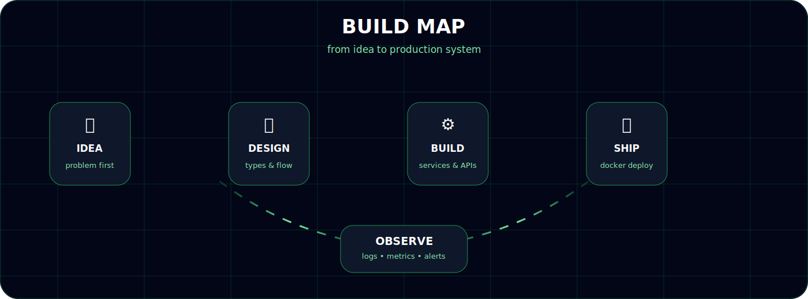
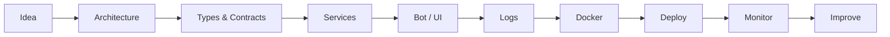

<div align="center">



</div>

<div align="center">

<a href="https://t.me/aliev_y">
  
</a>
<a href="https://github.com/Yunys26">
  
</a>


</div>

<br />

<div align="center">

[](https://git.io/typing-svg)

</div>


# 🛰 Mission Control

<div align="center">

| Module | Status | Direction |
|---|---:|---|
| 🤖 Telegram Bot Factory | `active` | bots, commands, middlewares, alerts, keyboards |
| ₮ Crypto Monitoring | `active` | TRON / USDT TRC20 transactions |
| 🛡 AML Engine | `building` | wallet datasets, labels, risk scoring |
| 📈 Exchange Integrations | `active` | MEXC, Bybit, Gate.io, KuCoin |
| 🌐 Web Development | `active` | Next.js, React, dashboards, SEO |
| 🐳 Infrastructure | `active` | Docker, VPS, Nginx, SSL, GitHub Actions |
| 📊 Observability | `always on` | logs, timings, diagnostics, alerts |

</div>


# 🧬 About Me

I am a developer who likes building tools that have a clear purpose:

> **track transactions, automate workflows, connect APIs, notify people, analyze risks and make complex processes easier.**

My favorite projects are systems where backend logic, business rules, infrastructure and UI work together as one product.

I do not like random code that only works once.  
I prefer systems that are understandable, maintainable, observable and ready to grow.

<div align="center">

| I care about | Why it matters |
|---|---|
| 🧱 Architecture | A project should be easy to grow, not painful to touch |
| 🧾 Logs | If something breaks, logs should explain what happened |
| 🛡 Safety | Errors, limits and edge cases must be handled |
| ⚡ Automation | Repetitive manual work should become a script or bot |
| 📦 Deployment | Local code should be easy to ship to production |
| 🧠 Business logic | Code should solve a real problem, not just look nice |

</div>

```ts
type FocusArea =
  | "Telegram Bots"
  | "Crypto Automation"
  | "AML Transaction Checks"
  | "Next.js Web Apps"
  | "Backend Services"
  | "Docker Infrastructure";

const yunys = {
  name: "Yunys Aliev",
  role: "TypeScript Developer",
  mode: "production-oriented development",

  focus: [
    "Telegram bot architecture",
    "USDT TRC20 transaction monitoring",
    "AML-style wallet risk checks",
    "exchange API integrations",
    "Next.js dashboards and websites",
    "Dockerized backend infrastructure"
  ] satisfies FocusArea[],

  engineeringValues: {
    code: "typed, readable, modular",
    logs: "structured and helpful",
    deploy: "repeatable and documented",
    product: "practical and useful"
  },

  rule: "Logs first. Types always. Errors handled. Deploy clean."
};
```


# ⚡ What I Build

<div align="center">

| Category | Examples |
|---|---|
| 🤖 **Telegram Bots** | transaction trackers, price alerts, admin bots, service notifications |
| ₮ **Crypto Automation** | wallet monitoring, USDT TRC20 tracking, exchange data aggregation |
| 🛡 **AML-style Tools** | risk labels, suspicious address datasets, transaction checks |
| 📈 **Market Tools** | spread detection, futures alerts, API polling, digest notifications |
| 🌐 **Web Apps** | Next.js websites, dashboards, forms, SEO-ready pages |
| 🧰 **Backend Systems** | REST APIs, services, database models, queues, schedulers |
| 🐳 **Infrastructure** | Docker, Nginx, SSL, VPS, GitHub Actions |
| 📚 **Documentation** | project structure, setup guides, troubleshooting notes |

</div>




# 🧰 Tech Arsenal

<div align="center">

## Languages & Core


<br />


## Backend


<br />


## Frontend


<br />


## DevOps & Infrastructure


<br />


## Crypto & APIs


</div>


# 🧠 Engineering DNA

<div align="center">

| Layer | My approach |
|---|---|
| 🧩 Project structure | `commands`, `handlers`, `services`, `repositories`, `utils`, `config` |
| 🧾 Config | `.env`, typed config, startup validation |
| 🛡 Error handling | explicit errors, safe fallbacks, useful messages |
| 📊 Logging | timestamps, request duration, context, file logs |
| 🚦 Rate limits | queues, batching, retry-after handling, digest mode |
| 🧪 Testing mindset | isolate business logic and make behavior predictable |
| 🚀 Deploy | Docker first, documented commands, reproducible setup |

</div>

---

# 🛰 Current Focus

```txt
[01] Telegram bots with TypeScript + Telegraf
[02] TRON / USDT TRC20 wallet monitoring
[03] AML-like transaction risk scoring
[04] Exchange API integrations
[05] Alert batching to avoid Telegram 429 limits
[06] Prisma + PostgreSQL backend architecture
[07] Docker / Nginx / VPS deployment
[08] Next.js production websites with SEO and i18n
```

---

# 🧪 Project Laboratory

<div align="center">

| Project | Description | Stack |
|---|---|---|
| [`bot-marvel-wallet-tracker`](https://github.com/Yunys26/bot-marvel-wallet-tracker) | Telegram bot for tracking USDT TRC20 wallet transactions | TypeScript, Telegraf, TRON APIs |
| `AML checker bot` | AML-style transaction analysis and wallet risk scoring | TypeScript, Telegram, datasets |
| `bot-arbitrage-spot` | Spot arbitrage scanner across crypto exchanges | TypeScript, REST APIs |
| `mexc-splash-five-percent` | Crypto futures movement alerts | TypeScript, MEXC API, Telegram |
| `bot-payout-tracker` | Payout tracking system with database | TypeScript, Prisma, PostgreSQL |
| `Polimer / plmtrade.com` | Production website and deployment setup | Next.js, Vercel, Nginx, SSL |

</div>

---

# 🧱 Architecture Style

```txt
src/
├── bot/
│   ├── commands/
│   ├── handlers/
│   ├── middlewares/
│   └── keyboards/
├── config/
│   ├── env.ts
│   └── logger.ts
├── services/
│   ├── tron/
│   ├── aml/
│   ├── exchanges/
│   └── telegram/
├── repositories/
│   └── prisma/
├── utils/
│   ├── formatters/
│   ├── guards/
│   └── retry/
└── index.ts
```



---

# 🧭 Development Flow



---

# 📊 GitHub Activity

<div align="center">


</div>

---

# 🏆 Trophy Wall

<div align="center">


</div>

---

# 🧩 Micro Skills

<div align="center">


</div>

---

# 🧱 Build Philosophy

> I do not just write code.  
> I build workflows, systems and tools that reduce manual work.

<div align="center">

| Before | After |
|---|---|
| Manual checking | Automated bot |
| Random errors | Structured logs |
| Repeated commands | Scripts |
| Hidden problems | Alerts |
| Unclear data | Typed models |
| Hard deploy | Dockerized workflow |

</div>

---

# 🌍 Connect

<div align="center">

<a href="https://t.me/aliev_y">
  
</a>

<br />
<br />

<a href="https://github.com/Yunys26">
  
</a>

</div>

---

<div align="center">

[](https://git.io/typing-svg)

</div>

<div align="center">


</div>
